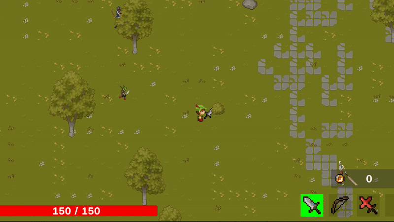
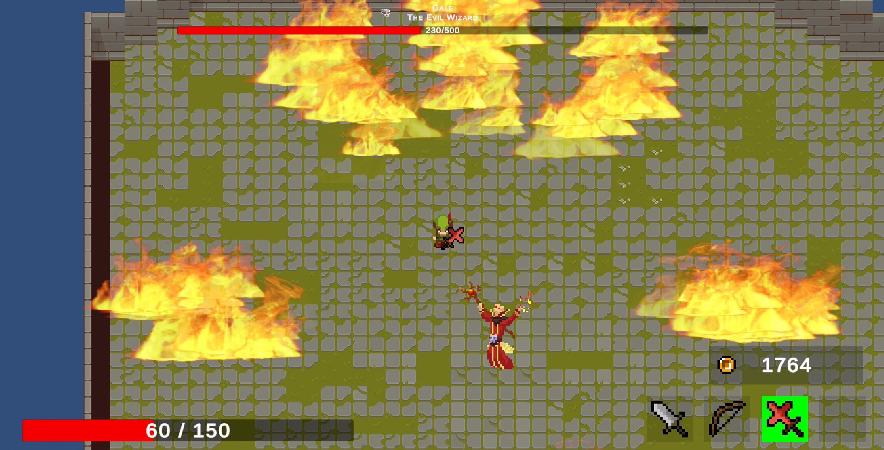
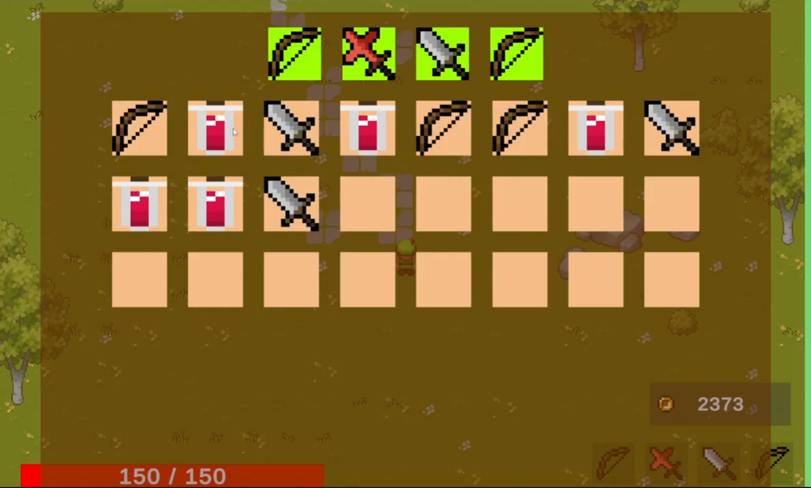
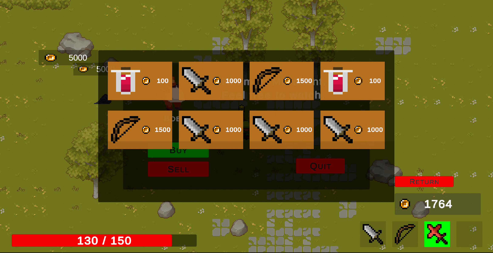
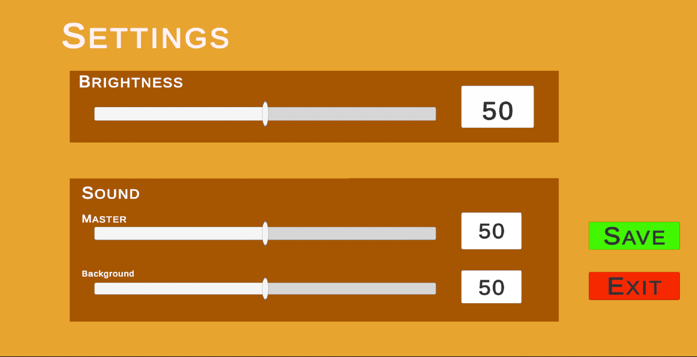

# FirstJourney

Unity 2D 탑다운 액션 RPG




**[게임 플레이 영상 보기](https://youtu.be/ZuVi_WUA-oU?si=Hd6RfRw5g67-3XFN)**

---

## 프로젝트 소개

Unity로 개발한 2D 탑다운 액션 RPG입니다. ScriptableObject 기반 데이터 아키텍처와 컴포넌트 패턴을 활용하여 확장성과 유지보수성을 높였습니다.

- **개발 기간**: 2023.11.14 ~ 2024.04.15
- **개발 인원**: 1인 개발
- **Unity 버전**: 2022.3.39f1 LTS

---

## 게임 플레이

### 주요 기능

- **오픈 필드 탐험**: 자유로운 맵 탐색 및 몬스터 사냥
- **4가지 무기 시스템**: 숫자키(1-4)로 실시간 무기 교체
- **체력 기반 보스 패턴**: HP 50%, 10% 단계별 특수 공격
- **마우스 방향 회피**: 클릭한 방향으로 즉시 회피
- **NPC 거래 시스템**: 아이템 구매 및 판매

### 게임 흐름

```
Start (메인 메뉴) → Forest (오픈 필드) → Boss Room → End (엔딩)
```

---

## 핵심 시스템

### 1. ScriptableObject 기반 무기 시스템


코드 수정 없이 Inspector에서 새로운 무기 추가 가능

- ItemData → WeaponData → MeleeWeaponData / RangedWeaponData
- 각 무기별 독립적인 애니메이션 컨트롤러
- 무기 교체 시 UI, 애니메이션, 사운드 자동 연동

### 2. 컴포넌트 기반 적 초기화 시스템


IComponentInitializer 인터페이스를 통해 필요한 기능만 조합

- BasicInitializer: 기본 이동/체력
- ChaseInitializer: 플레이어 추적
- AttackInitializer: 공격 패턴
- 다양한 적 유형을 에셋 조합으로 생성

### 3. 적 행동 패턴 시스템


상태 기반 AI로 복합적인 행동 패턴 구현

- **EnemyChase**: 플레이어 추적 및 장애물 회피 (BoxCast)
- **EnhancedChase**: 추적 + 피격 추적 + 순찰 조합
- **Patrol**: 웨이포인트 기반 순찰
- **Attack**: 근접/원거리 공격 시스템

### 4. 체력 기반 보스 시스템




Template Method 패턴으로 확장 가능한 보스 전투

- BossSpecialAttack 추상 클래스로 공통 기능 구현
- 체력 단계별 특수 패턴 (50% HP: 화염벽, 10% HP: 발악 패턴)
- 보스별 고유 공격 패턴 쉽게 추가 가능

### 5. 인벤토리 및 장비 시스템




싱글톤 패턴으로 전역 아이템 관리

- InventorySystem: 아이템 추가/제거 및 UI 동기화
- WeaponManager: 4슬롯 무기 장착 및 교체
- 무기 교체 시 AnimatorController 동적 교체

### 6. NPC 상호작용 시스템




NPCData 추상 클래스 기반 확장 가능한 NPC 시스템

- MerchantData: 상인 거래 기능
- BuySystem / SellSystem: 구매/판매 분리
- 상호작용 시 UI 동적 생성

### 7. 설정 시스템



Post Processing을 활용한 게임 설정

- **BrightnessManager**: Post Processing Volume으로 화면 밝기 실시간 조절
- **AudioManager**: 배경음악 및 효과음 볼륨 설정

---

## 기술 스택

### 개발 환경
- **엔진**: Unity 2022.3.39f1 LTS
- **언어**: C#
- **총 스크립트**: 110개

### Unity 패키지
- Input System (1.7.0) - 이벤트 기반 입력 처리
- Cinemachine (2.10.1) - 동적 카메라 시스템
- Post Processing (3.4.0) - 화면 효과
- TextMeshPro (3.0.6) - 고품질 텍스트

### 설계 패턴
- ScriptableObject 기반 데이터 아키텍처
- 싱글톤 패턴 (AudioManager, WeaponManager, InventorySystem)
- 컴포넌트 패턴
- Template Method 패턴
- Factory 패턴

### 구현 기술
- 마우스 위치 기반 8방향 공격 (Mathf.Atan2)
- Physics2D.BoxCast 활용 장애물 회피
- Rigidbody2D.MovePosition 물리 기반 이동
- 레이어 마스크 기반 무적 프레임
- UnityEvent 이벤트 시스템

---

## 프로젝트 구조

```
Assets/
├── Scripts/
│   ├── Player/           # 플레이어 관련 (이동, 공격, 체력)
│   ├── Enemy/            # 적 AI 및 행동 패턴
│   ├── Item/             # 아이템 및 무기 데이터
│   ├── System/           # 인벤토리, 오디오, UI 관리
│   ├── Boss/             # 보스 전투 시스템
│   └── NPC/              # NPC 상호작용
├── Scenes/
│   ├── Start             # 메인 메뉴
│   ├── Forest            # 메인 게임 필드
│   └── End               # 엔딩 화면
└── ScriptableObjects/    # 게임 데이터 에셋
```

---

## 설치 및 실행

### 플레이하기
1. [Releases](https://github.com/minsforgh/FirstJourney) 페이지에서 최신 빌드 다운로드
2. 압축 해제 후 실행 파일 실행

### 개발 환경 설정
1. Unity Hub 설치
2. Unity 2022.3.39f1 LTS 버전 설치
3. 프로젝트 클론
```bash
git clone https://github.com/minsforgh/FirstJourney.git
```
4. Unity Hub에서 프로젝트 열기

> **주의**: 이 레포는 코드 및 씬 구조 확인을 위한 포트폴리오용입니다.
> 외부 에셋(캐릭터, 환경, 이펙트 등)은 저작권 문제로 포함되지 않아 **에디터에서 바로 실행되지 않습니다.**

---

## 조작 방법

- **WASD**: 이동
- **마우스 좌클릭**: 공격 (마우스 방향)
- **마우스 우클릭**: 회피 (마우스 방향)
- **숫자키 1-4**: 무기 교체
- **I**: 인벤토리 열기/닫기
- **E**: NPC 상호작용

---

## 개발 하이라이트

- **확장 가능한 아키텍처**: ScriptableObject로 데이터와 로직 분리
- **물리 기반 AI**: BoxCast를 활용한 정교한 장애물 회피
- **동적 애니메이션**: 무기 교체 시 RuntimeAnimatorController 교체
- **이벤트 기반 시스템**: UnityEvent로 컴포넌트 간 느슨한 결합

---

## 라이선스

이 프로젝트는 학습 목적으로 제작되었습니다.

---

## 연락처

- GitHub: [@minsforgh](https://github.com/minsforgh)
- Email: minsfor@gmail.com